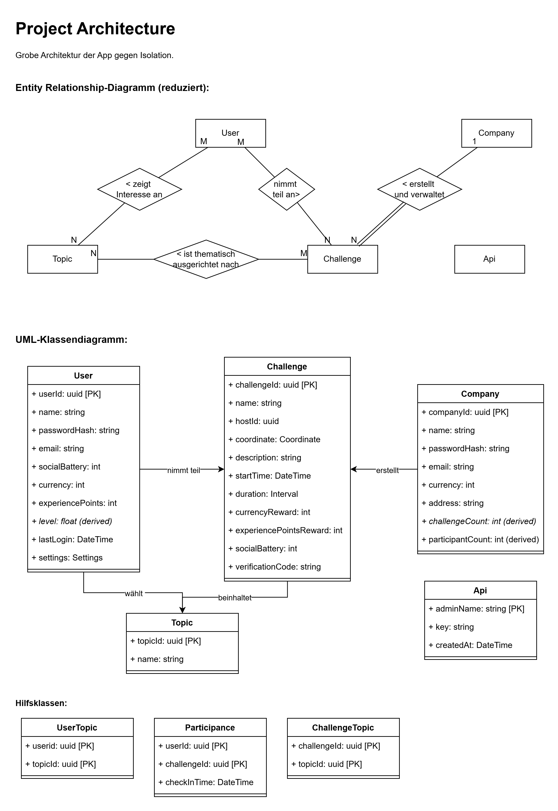

# GoTogether

Soziale Netzwerke verbinden digital, aber schaffen oft keine echten Beziehungen.
Die Nutzer wünschen sich echte Begegnungen, nachhaltige Freundschaften oder zumindest tiefere soziale Interaktionen.

## LICENSE

Der Quellcode dieses Projekts ist unter der MIT-Lizenz veröffentlicht. Weitere Informationen finden Sie in der Lizenzdatei `src/LICENSE`.
Die Dokumentation und alle begleitenden Materialien sind unter der CC-BY 4.0-Lizenz (siehe `documentation/LICENSE`) veröffentlicht.

## Themenbeschreibung (Thema 3)

App gegen Einsamkeit

- ca. 10-14% der Menschen in Deutschland fühlen
  sich einsam. Ob soziale Netzwerk die Situation
  verbessern oder verschlechtern kann nicht
  eindeutig gesagt werden. [1][2]
- Entwerfen Sie ein neues soziales Netzwerk bzw.
  App welche Einsamkeit bei
  Jugendlichen/Erwachsenen/Rentnern verringert.
- Mögliche Apps: Soziale Netzwerke, Dating-App,
  App für gemeinsame Aktivitäten, Spiele-App ...

## Projektcharakteristik

> Ein Projekt ist ein zielgerichtetes, zeitlich begrenztes Vorhaben zur Schaffung eines neuartigen Produktes oder Dienstleistung. (siehe Vorlesungsskript)

Folgende Eigenschaften bestätigen die Klassifikation als Projekt:

- Zielklarheit: Anhand des unten definierten SMART-Ziels ist ersichtlich, dass das Projekt das klare Ziel zur Bekämpfung von Isolation hat.
- Einmaligkeit und Neuartigkeit: Die Aufgabe erfolgt nicht als Routinetätigkeit und bringt neuwertige Blickwinkel und Ansätze mit sich.
- Schwierigkeit der Aufgabe: Die Nicht-Trivialität der App-Entwicklung setzt starke Kompetenzen in dem Gebiet voraus.
- Prozesscharakter mit vielen Arbeitsschritten: Die zugrundeliegende SCRUM-Arbeitsmethode bündelt die Aufgaben in Sprints und setzt eine schrittweise Verfeinerung des MVPs voraus.
- Terminierung: Das Projekt muss innerhalb des Sommersemesters 2026 zur Prüfungsphase abgeschlossen sein.
- Teambildung: Ein SCRUM-Team mit 5 Personen ist involviert.
- Ressourcenbegrenztheit: Zeitliche und finanzielle Ressourcen sind durch die Studienumgebung stark begrenzt.

Daher kann das Vorhaben als Projekt verstanden werden. Als Projektart trifft hierbei das Entwicklungsprojekt zu, das sich mit einem hohen Neuartigkeitsgrad und konkreten Zielsetzungen charakterisiert. Dabei ist die Unsicherheit im Vergleich zur Forschung eher als gering zu betrachten.

---

## Notizen aus Kundengesprächen (Thema 3)

- Seit dem ich geschieden bin, fühle ich mich hin und wieder sehr einsam. Diese Apps oder Netzwerke bieten vielleicht für junge Menschen Kontakte. Ich kann hier nur schwer jemanden kennenlernen.
- In meiner Schulzeit habe ich angefangen Videos für Tiktok zu machen. Nun bin ich auch auf Instagram. Ich habe zwar viele Follower, aber niemanden, den ich jetzt als guten Freund oder Freundin bezeichnen würde. Das ist sehr schade.
- Ich bin nun seit 2 Jahren hier in München und versuche Menschen kennenzulernen. Teilweise ist dies nicht einfach. Manchmal fühle ich mich einsam, obwohl ich mit vielen Personen auf Instagram kommuniziere. Auch mit Tinder lerne und nur schwer jemanden kennen, geschweige denn einen guten Freund.
- Seit 2022 lebe ich nun in Amberg. Die Menschen sind sehr offen. Ich habe auch schon ein paar Leute kennengelernt. Aber dennoch fühle ich mich manchmal einsam. Ich wünsche mir etwas, dass dies ändern könnte. Soziale Netzwerke tragen zwar das Label „sozial“ aber soviel erlebe ich nicht davon.

## Personas (Nutzersegmente)

1. Karin, 54 – frisch geschieden, sucht Anschluss
   Fühlt sich im mittleren Alter häufig ausgeschlossen von Online-Communitys
   Technisch ok, aber nicht begeistert
   Wünscht: niederschwellige Kontakte, reale Treffen, Sicherheit

2. Lena, 17 – Influencerin, aber ohne „echte“ Freunde
   Viele Follower, aber nicht viele echte Beziehungen
   Wünscht: echte Freundinnen, nicht noch mehr Likes

3. Tom, 29 – neu in München, social-media-müde
   Kommuniziert viel online, aber keine tiefen Verbindungen
   Will: Freundschaften mit gemeinsamen Interessen

4. Marcel, 34 – sozial offen, aber fühlt sich dennoch einsam
   Hat Kontakte, aber keine vertrauten Beziehungen
   Will: „Qualität“, nicht „Quantität“ der Beziehungen

## Problemstellung

**TL;DR: Oberflächliche Online-Interaktionen schaffen keine echten Beziehungen und verstärken Einsamkeit.**

### Unterprobleme:

Oberflächliche Interaktion statt echter Beziehung:

- Likes, Follower, Chatten --> "soziale Aktivität" ohne emotionale Tiefe. (Lena, 17)
- Studien bestätigen, dass Social Media echte Verbundenheit nicht ersetzt. ([Einsamkeitsreport TK 2024](https://www.tk.de/resource/blob/2186830/73239d0d1b389491c47f1bf7960ed254/2024-tk-einsamkeitsreport-data.pdf))

Passiver Social Media-Konsum führt zu Einsamkeit:

- Nur Inhalte scrollen verschärft Einsamkeit. ([JRC Studie 2024](https://joint-research-centre.ec.europa.eu/jrc-news-and-updates/how-you-scroll-matters-passive-social-media-use-linked-loneliness-2024-12-13_en))
- Viele fühlen sich trotz großer Online-Präsenz innerlich isoliert (Tom, 29).

Fehlende lokale, reale, niedrigschwellige Sozialkontakte:

- Für Erwachsene ab 40+ sind bestehende Plattformen schlecht geeignet. (Karin, 54)
- Umzüge erhöhen Einsamkeit stark. ([Einsamkeitsreport TK 2024](https://www.tk.de/resource/blob/2186830/73239d0d1b389491c47f1bf7960ed254/2024-tk-einsamkeitsreport-data.pdf))

### Problemdefinition

Trotz zunehmender digitaler Vernetzung durch Social Media Plattformen wird Einsamkeit und fehlende Bindung beschrieben. Oberflächliche Interaktionen, passiver Konsum, fehlende lokale Angebote und unzureichende Unterstützung bei Lebensveränderungen tragen dazu bei, dass sich Menschen trotz Online-Aktivität einsam fühlen. Es fehlt eine Lösung für tiefgehende soziale Beziehungen und persönlichen Begegnungen, die über digitale Profile hinausgehen.

---

## App-Idee

**TL;DR: Die App kombiniert City‑Quests, ein emotions- und interessenbasiertes Matching sowie einen KI‑Assistenten, um aus digitalen Kontakten echte Begegnungen zu machen. Spielerische Herausforderungen, lokale Events und eine Social Map erleichtern spontane Treffen, während Gamification‑Elemente langfristig zur Teilnahme motivieren. Durch den Social‑Battery‑Index und personalisierte Empfehlungen bleibt jede Aktivität an die individuellen sozialen Bedürfnisse der Nutzer angepasst.**

1. **City Quests**
   Inspiriert von Pokémon Go. Fokus auf spielbare, lokale Stadt-Challenges, die gegenseitiges Kennenlernen fördern.
   - Lokale Treffpunkte: Treffpunkte (Parks, Cafés, Sehenswürdigkeiten) - Minispiele, Treffen, Austausch
   - Micro-Challenges für Begegnungen, z.B. mit anderen App-Nutzern vor Ort sprechen,
     > Pokémon Go steigert spontane soziale Treffen ([Forschung](https://newsroom.niu.edu/more-than-a-game-niu-psychology-professor-measures-pokemon-gos-impact-on-belonging/))
   - Team-Raids für soziale Aktivitäten: Gemeinsam größere Aufgaben lösen, z.B. Reinigungsaktion, großer Park-Picknick, stadtweite Schnitzeljagd/Aktion, Fotografieren
   - Zeitlich begrenzte Events, z.B. Stadtfeste, Feiertage, Angebote.
   - Dauerhafte Teams: Semi-permanente Zuordnung nach Aspekten in eine von mehreren (2-5) Gruppen.
   - Level- oder Team-abhängige Herausforderungen für Anfänger bis Fortgeschrittene.

2. **Persönlichkeits- & Emotionsorientierte Matchings**
   - Social Battery Index: Wie viel Energie für soziale Interaktion. (Wenig Energie = ruhige 1:1-Aktivitäten, viel Energie = Gruppenquests & Events)
   - Gemeinsame Interessen (Emotional Needs Matching). Z.B.: Hunde, Wandern, Kunst, Kochen.
     > Basierend auf [Gamification‑Studien und Anti‑Einsamkeits‑Apps ](https://openhsu.ub.hsu-hh.de/entities/publication/15111). Jüngere profitieren auch von virtuellen Kontakten, ältere benötigen eher persönliche Interaktionen ([Studie](https://www.tandfonline.com/doi/pdf/10.1080/10447318.2025.2543994)).

3. **KI-Personal Assistant**
   - Motivation & Aktivitätsvorschläge für Nutzer, anhand von Standort, Interessen, Social Battery Index, etc.
   - Lokale Empfehlungen für Aktivitäten, Events, Gruppen. (Werbung möglich)
   - Begleitung für persönliche Entwicklung und Fortschritte, inkl. empathisches Coaching für Sozialisierung & Reflexionsimpulse
   - Starke Leitplanken für Sicherheit, Privatsphäre, ethische KI-Nutzung. Werbeanzeigen nur mit klarer Kennzeichnung, keine manipulative Werbung, Datenschutz im Fokus.
4. **Gamification & Rewards**
   - Belohnungen (Avatar-Deko, Skins, virtuelle Haustiere, Abzeichen, Level-Ups), auch AR-kompatibel
   - Digitale Währung. Für In-App-Käufe, lokale Partnerangebote, Spendenaktionen, Coupons, Payback-Coupons, Loot-Boxen, Saison-Pässe. Digitale Währung auch von Werbenden als Aktivitäts-Belohnung kaufbar.
   - Echtwert-Coupons, nur für lokale Geschäfte, Cafés, Events. Förderung der lokalen Wirtschaft und realer Begegnungen. Kooperation mit lokalen Unternehmen möglich.
   - Boni/Meilensteine für regelmäßige Aktivität, Freundschaftsaufbau, Challenges und Stadtmissionen
   - Teilnahmeverifizierung durch QR-Codes vor Ort oder als (verschlüsselter) Austausch mit anderen Nutzern, daher kein [GPS-Spoofing](https://de.wikipedia.org/wiki/GPS-Spoofing#HeroSection) möglich.

5. **Social Map**
   Inspiriert z.B. von Pokémon Go, [Jagat](https://techcrunch.com/2023/12/15/jagat-location-based-social-network-focuses-on-real-life-connections-surpasses-10m-users/) und Ingress Prime. Interaktive Live-Karte.
   - Interaktive Echtzeit-Karte.
     - Enger Radius (ca. 50m): Andere Online-Nutzer in der Nähe.
     - Erweiterter Radius (ca. 500m): Lokale Events, Challenges, Treffpunkte, Gruppenaktivitäten, lokale Angebote. Werbung möglich.
     - Großer Radius (ca. 3km): Empfehlungen für Orte/Aktivitäten. KI-gestützt, Werbung möglich.
   - Anonymität & Sicherheit: Optionaler Safe Mode für komplette Anonymität. Optionale Sichtbarkeit für Freunde. Safe Spots (z.B. Cafés) vorhanden. Profil-Verifizierung möglich.

## Kommerzialisierung

- Dekorationsobjekte
-

## Ziel der App (SMART)

S: Die App soll durch lokale, spielerische Herausforderungen (City Quests), Interessensmatching, einen KI‑Assistenten sowie eine interaktive Social Map reale soziale Begegnungen fördern und damit Einsamkeit in allen Altersgruppen reduzieren.
M: Ein Click-Dummy mit Pseudo-Karte inkl. Challenges, Corporate Design. Full Stack Softwareprototyp der App-Infrastruktur, responsive Design mit integrierter Karte und Challenges.
A: Trotz zunehmender digitaler Vernetzung durch Social Media Plattformen wird Einsamkeit und fehlende Bindung beschrieben. Oberflächliche Interaktionen, passiver Konsum, fehlende lokale Angebote und unzureichende Unterstützung bei Lebensveränderungen tragen dazu bei, dass sich Menschen trotz Online-Aktivität einsam fühlen. Es fehlt eine Lösung für tiefgehende soziale Beziehungen und persönlichen Begegnungen, die über digitale Profile hinausgehen.
R: Erreichbarkeit durch bestehende Open-Source Lösungen (z.B. Open Street Map), Kollaboration im SCRUM-Team mit 7 Personen und klare Aufgabenteilung.
T: Bis zur Projektabgabe im Juli des Sommersemesters 2026.

## Grober Projektplan

1. Sprint: Click Dummy, Corporate Design, Karte, inhaltliche Definition der Challenges, Softwarestruktur erstellen.
2. Sprint: Grobe Softwarearchitektur, Full-Stack Funktionalität (DB, Backend, Frontend), Challenges implementieren, Karte implementieren.
3. Sprint: Feine Softwarearchitektur, Interaktive Karte mit Challenges, Gamification-Elemente mit Belohnungen.
4. Sprint: offen.
   Abschluss: offen.

## User Stories

### Inhaltliche User Stories

1. **Social Battery:** Als Nutzer\*in, möchte ich beim ersten Öffnen der App meinen sozialen Energielevel eingeben und flexibel über den Tag anpassen können, um Vorschläge zu erhalten, die meiner aktuellen emotionalen Belastbarkeit entsprechen (z. B. ruhige Treffen vs. Gruppenquests).
2. **Lokale Challenges:** Als Person, die neue Menschen in meinem Umfeld kennenlernen möchte, möchte ich aus einer Auswahl lokaler Quests/Challenges wählen können, um unkompliziert Kontakt zu echten Menschen in meiner Nähe aufzubauen und soziale Barrieren zu überwinden.
3. **Interessensmatching:** Als Nutzer\*in mit spezifischen Hobbys und Leidenschaften, möchte ich meine Interessen mit Prioritäten eintragen können, um Menschen zu finden, mit denen ich leichter eine gemeinsame Grundlage für echte Gespräche oder Aktivitäten habe.
4. **Teamvorschläge:** Als sozial offener Mensch, der dennoch Struktur sucht (z. B. Marcel, 34), möchte ich auf Basis meines Profils ein Team vorgeschlagen bekommen, um mich einer Gruppe zugehörig zu fühlen und wiederkehrende soziale Anknüpfungspunkte zu haben.
5. **KI‑Assistent:** Als Nutzer\*in, möchte ich einen verständnisvollen, sicheren und diskreten KI‑Assistenten haben, der mich motiviert, passende Aktivitäten vorschlägt und meine Fortschritte reflektiert, um leichter soziale Kontakte aufzubauen und mich persönlich weiterzuentwickeln.
6. **Echtzeitkarte:** Als Person, die sich einsam fühlt (z. B. Karin oder Tom), möchte ich auf einer sicheren Echtzeitkarte sehen, wo sich Aktivitäten, Quests und potenzielle Begegnungsmöglichkeiten in meiner Umgebung befinden, um spontan an sozialen Ereignissen teilnehmen zu können.
7. **Spielerische Fortschrittsverfolgung:** Als Nutzer\*in, möchte ich durch Challenges, regelmäßige Teilnahme, soziale Interaktionen und optional durch In-App Käufe virtuelle Dekorationsobjekte, Abzeichen und die digitale Währung sammeln, um motiviert zu bleiben und meine Fortschritte spielerisch wahrzunehmen.
8. **Sozialer Fortschritt:** Als Nutzer\*in, möchte ich meinen sozialen Fortschritt (z. B. neue Kontakte, Treffen, Quests in Gruppen, Freunde) nachvollziehen können, um zu sehen, wie ich mich sozial weiterentwickle und motiviert bleibe.

### Technische User Stories

9. **Teilnahmeverifizierung:** Als Nutzer\*in, möchte ich meine Teilnahme an Quests oder Treffen einfach und sicher über ein einfaches digitales Verfahren bestätigen können, um sicherzustellen, dass Belohnungen nur für echte, vor Ort durchgeführte Aktivitäten vergeben werden.
10. **Anonyme Nutzung:** Als sicherheitsbewusste Person, möchte ich meinen Standort und mein Profil vor anderen Nutzern und Unternehmen anonymisieren können, um die App nutzen zu können, ohne mich unwohl oder unsicher zu fühlen.

### Unternehmensbezogene User Stories

11. **Promotion & Marketing:** Als lokales Unternehmen möchte ich eigene Challenges, Quests oder Events in der App erstellen und lokale Empfehlungen (z. B. Café, Laden, Event) in einem transparenten Auktionsverfahren platzieren können, um Kampagnen zu starten, die Nutzer\*innen motivieren, mein Geschäft oder meine Veranstaltungen zu besuchen.
12. **Ausgabe von In‑App‑Währung:** Als lokales Unternehmen möchte ich die digitale In‑App‑Währung über einen einfachen und für private Nutzer identischen Kaufprozess erwerben können, um sie als Belohnung für meine Challenges und Events an Nutzer\*innen ausgeben zu können.

### Nachtrag zu den User Stories

13. **Authentifizierung:** Registierung und Login des Nutzers.

14. **Profilansicht und -verwaltung:** Als Nutzer möchte ich mein eigenes Profil mit meinen Interessen, meinem Social Battery Index, meiner digitalen Währung und meinen Erfahrungspunkten einsehen und Einstellungen vornehmen können, um meine App-Nutzung an meine Bedürfnisse anzupassen.

## MVP

- Offene, lokale Liste für Challenges inkl. Challenge-Filter, damit spontane Teilnahme möglich ist. _(User Story #2, Persona: Tom, Karin)_
<!-- - Echtzeitkarte mit eigenem Standort-Marker und dynamischen Challenges (Koordinaten, nächstgelegene Adresse, Interessenskeyword, Name, Beschreibung, Datum, Themen/Interessen (z.B. Cafe, Politik, ...), Startzeit, voraussichtliche Endzeit, Erfahrungspunkte, Anzahl der digitalen Währung, soziale Anstrengung). _(User Story #6, Persona: Karin, Tom)_ -->
<!-- - Event-/Challenge-Erstellung per API durch Unternehmensprofile inkl. Interessenskeywords. _(User Story #11, #12)_ -->
<!-- - Social-Battery-Inputfeld mit visuellem Status und Filterlogik für passende Aktivitätsvorschläge. _(User Story #1, Persona: Karin, Tom)_ -->
- Interessensmatching über auswählbare Interessen-Keywords aus einer vorgegebenen Liste, kombiniert mit Challenge-Filter. _(User Story #3, Persona: Lena, Tom, Marcel)_
<!-- - Teilnahmeverifizierung per [QR-Code und] 5-stelligen Code (Challenge-bezogen) inkl. Check-in vor Ort. _(User Story #9)_ -->
- Belohnungssystem mit Erfahrungspunkten und digitaler Währung für absolvierte Aktivitäten. _(User Story #7, Persona: Lena, Marcel)_
- KI Chatbot-Nachricht beim Login in die App mit Vorschlag für eine Challenge, anhand des Interessensmatchings _(User Story #5, #3)_

## Ähnliche Apps

1. Grouya: Ist eine Matching-App für spontane Freizeitaktivitäten und gesellschaftlicher Isolation entgegenwirken. Beinhaltet Kartenfunktion und Live Events, aber KEIN Belohnungssystem.
   Wenige, aber sehr gute Bewertungen; UX ist sehr gut
2. Meet5: Gemeinsame Interessen Gleichgesinnte für Freizeitaktivitäten finden. Konkrete Zielgruppe: Ü-40
3. Bumble BFF setzt auf „Gamified Experience" im Sinne des Swipe-Mechanismus, der das Browsing intuitiv und risikoarm macht — aber kein echtes Punktesystem. -> Interessant könnte das Swipen sein, um neue Aktivitäten kennenzulernen

## Studienlage

### 1. Passives vs. aktives Nutzungsverhalten

Die Art der Nutzung sozialer Medien – nicht die bloße Nutzungsdauer – ist entscheidend dafür, ob digitale Plattformen Einsamkeit verstärken oder abmildern. Wissenschaftler der Gemeinsamen Forschungsstelle (JRC) der Europäischen Kommission konnten auf Basis einer EU-weiten Erhebung (2022) erstmals ein klares Muster nachweisen: Passive Nutzung, also das stille Konsumieren von Inhalten ohne eigene Interaktion, steht in einem unmittelbaren Zusammenhang mit erhöhtem Einsamkeitserleben ([JRC, 2024](https://www.basicthinking.de/blog/2024/12/19/einsamkeit-und-social-media-wissenschaftler-entschluesseln-zusammenhang/); [iTopnews, 2025](https://www.itopnews.de/2025/01/neue-studie-untersucht-gefuehl-von-einsamkeit-im-zusammenhang-mit-social-media/)). Im Gegensatz dazu zeigt sich, dass aktive Nutzungsformen – wie das Verfassen eigener Beiträge oder direkte Kommunikation mit anderen – positive soziale Bindungen fördern können. Dieses Muster bestätigt auch eine aktuelle qualitative Studie, die das sogenannte „Authentizitäts-Sichtbarkeits-Paradox" beschreibt: Je mehr Nutzerinnen und Nutzer online sichtbar werden, desto weniger authentisch präsentieren sie sich – was echte Verbindungen zusätzlich untergräbt ([Beyond virtual proximity, Tandfonline, 2025](https://www.tandfonline.com/doi/full/10.1080/17459435.2025.2539115)). Für die Entwicklung digitaler Interventionen gegen Einsamkeit ergibt sich daraus eine zentrale Implikation: Eine App, die Nutzerinnen und Nutzer gezielt zu aktiver Teilnahme und echter Interaktion motiviert, adressiert genau jenen Mechanismus, der bei rein passiv konsumierten Plattformen zur Isolation beiträgt.

### 2. Verbreitung von Einsamkeit unter Jugendlichen und jungen Erwachsenen

Einsamkeit unter jungen Menschen ist kein Randphänomen, sondern ein weit verbreitetes gesellschaftliches Problem mit messbarem Ausmaß. Laut der deutschen [JIM-Studie 2024](https://www.mpfs.de/studien/jim-studie/2024/) liegt die durchschnittliche tägliche Bildschirmzeit von Jugendlichen bei 224 Minuten – ein seit der Pandemie anhaltend hohes Niveau ([Edit Magazin, 2025](https://www.edit-magazin.de/scrollen-wir-uns-einsam.html)). Eine Erhebung des IFT-Nord zeigt, dass sich 31 % der befragten Schülerinnen und Schüler regelmäßig einsam fühlen; bei jungen Erwachsenen zwischen 16 und 30 Jahren steigt dieser Wert auf fast 46 % für moderate emotionale Einsamkeit ([IFT-Nord, zit. nach Edit Magazin, 2025](https://www.edit-magazin.de/scrollen-wir-uns-einsam.html)). Ergänzend zeigt eine US-amerikanische Studie mit 1.512 Erwachsenen, dass sowohl die Nutzungshäufigkeit als auch die verbrachte Zeit auf sozialen Medien unabhängig voneinander linear mit Einsamkeit assoziiert sind ([Gorman et al., 2025, NCBI](https://www.ncbi.nlm.nih.gov/pmc/articles/PMC12562821/)). Besonders aufschlussreich ist dabei die repräsentative Studie „Generation einsam?" der Vodafone Stiftung (Infratest dimap, 2025, n = 1.046): Knapp die Hälfte der befragten 14- bis 20-Jährigen nutzt soziale Medien mit dem expliziten Ziel, sich weniger einsam zu fühlen – wobei besonders jene mit ausgeprägten Einsamkeitserfahrungen überdurchschnittlich häufig auf Social-Media-Angebote zurückgreifen ([Vodafone Stiftung, 2025](https://www.vodafone-stiftung.de/generation-einsam/)). Dies deutet auf einen Selbstverstärkungseffekt hin: Wer einsam ist, greift mehr zu sozialen Medien, ohne dass diese das Einsamkeitsgefühl nachhaltig lindern.

### 3. Online- vs. Offline-Interaktion – was tatsächlich hilft

Trotz der zunehmenden Verlagerung sozialer Kontakte in digitale Räume zeigt die Forschung konsistent, dass persönliche Begegnungen in ihrer Wirkung auf das Wohlbefinden deutlich überlegen sind. Mehrere Studien belegen, dass Menschen nach Face-to-Face-Interaktionen höhere positive Emotionen, niedrigere negative Emotionen und signifikant weniger Einsamkeit berichten als nach digitalen Interaktionen ([Elmer et al., 2025](https://journals.sagepub.com/doi/10.1177/00936502251341088)). Auf quantitativer Ebene zeigt eine australische Studie, dass persönliche Begegnungen und Telefongespräche die Wahrscheinlichkeit von Einsamkeit bei Erwachsenen um 16–30 % reduzieren können ([Social Technology Use and Loneliness, Tandfonline, 2025](https://www.tandfonline.com/doi/full/10.1080/10447318.2025.2543994)). Das deckt sich mit der sogenannten Stimulationshypothese: Internet- und App-Nutzung wirkt einsamkeitsreduzierend, wenn sie bestehende Beziehungen stärkt oder neue soziale Verbindungen anbahnt – schlägt jedoch ins Gegenteil um, wenn sie als Rückzug aus der realen Welt genutzt wird ([AMA Journal of Ethics, 2023](https://journalofethics.ama-assn.org/article/internet-and-loneliness/2023-11)). Gleichzeitig belegt ein systematisches Review und eine Meta-Analyse digitaler Interventionen, dass gruppenbasierte digitale Ansätze mit einer Effektstärke von d = −0,34 deutlich wirksamer sind als individuelle (d = −0,16) – jedoch beide hinter nicht-digitalen Interventionen zurückbleiben (d ≈ −0,50) ([Digital bridges to social connection, ScienceDirect, 2025](https://www.sciencedirect.com/science/article/pii/S2214782925000570)). Für die Konzeption einer Anwendung zur Einsamkeitsreduktion ergibt sich daraus klar: Der vielversprechendste Ansatz liegt nicht in der Schaffung weiterer virtueller Sozialräume, sondern in einer digitalen Plattform, die gezielt als Brücke in die reale, physische Begegnung dient.

## Rollenverteilung

Folgende Verteilung der Rollen im Team ist festgelegt:

- Erik D: Frontend, Design
- Hasan: Frontend, Design
- Johannes: Architektur, DB, Backend
- SimonV: Architektur, Scrum Master
- Tien: Backend, Product Owner
- Julia: DB, Backend, Frontend
- SimonF: Frontend, (Backend)
- Mattis: Frontend, Design

Aufteilung nach Rollen:

- Architektur: Johannes, SimonV
- Backend: Johannes, Tien, Julia, SimonF
- Datenbank: Johannes, Julia
- Design: Erik D, Hasan, Mattis
- Frontend: Erik D, Hasan, Julia, SimonF, Mattis
- Orga: SimonV
- Product Owner: Tien
- Scrum Master: SimonV

## MVP

- Offene, lokale Liste für Challenges inkl. Challenge-Filter, damit spontane Teilnahme möglich ist. _(User Story #2, Persona: Tom, Karin)_
- Echtzeitkarte mit eigenem Standort-Marker und dynamischen Challenges (Koordinaten, nächstgelegene Adresse, Interessenskeyword, Name, Beschreibung, Datum, Themen/Interessen (z.B. Cafe, Politik, ...), Startzeit, voraussichtliche Endzeit, Erfahrungspunkte, Anzahl der digitalen Währung, soziale Anstrengung). _(User Story #6, Persona: Karin, Tom)_
- Event-/Challenge-Erstellung per API durch Unternehmensprofile inkl. Interessenskeywords. _(User Story #11, #12)_
- Social-Battery-Inputfeld mit visuellem Status und Filterlogik für passende Aktivitätsvorschläge. _(User Story #1, Persona: Karin, Tom)_
- Interessensmatching über auswählbare Interessen-Keywords aus einer vorgegebenen Liste, kombiniert mit Challenge-Filter. _(User Story #3, Persona: Lena, Tom, Marcel)_
- Teilnahmeverifizierung per QR-Code und 5-stelligem Code (Challenge-bezogen) inkl. Check-in vor Ort. _(User Story #9)_
- Belohnungssystem mit Erfahrungspunkten und digitaler Währung für absolvierte Aktivitäten. _(User Story #7, Persona: Lena, Marcel)_

## Architecture

### Drei-Schichten-Architektur

Die Architektur folgt dem MVP und konzentriert sich auf die Kern-Use-Cases aus den Abschnitten MVP, Inhaltliche User Stories, Technische User Stories und Unternehmensbezogene User Stories.

**Presentation Tier:** Die React-Native-App zeigt die offene Challenge-Liste, die Echtzeitkarte, Social-Battery, Matching und den Reward-Status. Sie kapselt nur die UI und kommuniziert über die API mit dem Backend.

**Application Tier:** Das Java Springboot mit REST-API Schnittstelle als Backend setzt die MVP-Logik um: Challenge-Filter, Kartenabfragen, Social-Battery-Filter, Interessen-Matching, QR-Check-in, Belohnungen und Unternehmens-APIs für Events oder Challenges.

**Data Tier:** PostgreSQL speichert die dafür nötigen Daten wie Nutzer, Profile, Interessen, Quests, Events, Check-ins, Freundschaften, Rewards und Unternehmensprofile.

### Grobe Klassenstruktur

- Frontend: `MapScreen` (Karte anzeigen), `QuestListScreen` (Challenges listen), `SocialBatteryInput` (Energie wählen), `MatchingView` (Passende Menschen), `CheckInView` (Teilnahme bestätigen), `RewardView` (Belohnungen sehen)
- Backend Controller: `AuthController` (Anfragen annehmen), `UserController` (Nutzer verwalten), `QuestController` (Quests steuern), `MatchingController` (Vorschläge liefern), `CheckInController` (Check-ins prüfen), `RewardController` (Punkte vergeben), `CompanyController` (Firmenaktionen verwalten)
- Backend Services: `AuthService` (Login-Logik), `UserService` (Profil-Logik), `QuestService` (Quest-Logik), `MatchingService` (Match-Regeln), `CheckInService` (Check-in-Regeln), `RewardService` (Reward-Regeln), `MapService` (Kartenabfragen)
- Datenzugriff/Modelle: `User` (Nutzer speichern), `Profile` (Profilwerte halten), `Interest` (Interessen abbilden), `Quest` (Challenge-Daten), `Event` (Termine speichern), `CheckIn` (Teilnahmen protokollieren), `Reward` (Belohnungen speichern), `Wallet` (Währung führen), `Friendship` (Freunde verknüpfen), `Company` (Firmenprofile speichern)

Controller heißen so, weil sie HTTP-Anfragen entgegennehmen und an die passende Logik weitergeben. Services heißen so, weil sie die fachliche Logik bündeln und unabhängig von UI oder Datenbank bleiben. Modelle heißen so, weil sie die Datenobjekte des Systems beschreiben.

So entsteht eine klare Trennung: UI für Interaktion, Backend für die MVP-Geschäftslogik und PostgreSQL für Persistenz. Für die Bewertung ist damit gut erkennbar, welche Teile direkt umgesetzt werden sollen.

### Repository Structure

- `src/backend`: Java Springboot Backend mit REST-API
   - `controller`: REST-Controller für Endpunkte
   - `services`: Geschäftslogik für Use Cases
   - `model`: JPA-Entities und Embeddables für DB
   - `repository`: JPA-Repositories für DB-Zugriff
   - `dto`: Data Transfer Objects für API-Kommunikation
- `src/frontend`: React-Native App
   - `components`: Wiederverwendbare UI-Komponenten 
   - `screens`: Hauptbildschirme der App
   - `services`: API-Client und Logik für Frontend
   - `assets`: Bilder, Icons, Styles

## Backend-Architecture

The backend is a Spring Boot application split into the standard layers: controllers expose REST endpoints, services contain the business logic, mappers translate between entities and DTOs, and JPA entities persist to PostgreSQL. All identifiers are `UUID`s generated with `GenerationType.UUID`, and controllers consistently return `ResponseEntity<?>` while mapping `RuntimeException`s to HTTP status codes.

### Database and Models

JPA entities and embeddables live in the [model](src/backend/src/main/java/com/gotogether/backend/model) package.

#### Entities

- **[`User`](src/backend/src/main/java/com/gotogether/backend/model/User.java)** (`users` table): `id : UUID`, `name`, `password`, `email` (unique), `socialBattery` (0–100, default 100), `currency` (default 0), `experiencePoints` (default 0), a many-to-many list of `interests` (linked to `Topic` via the `user_interests` join table), `lastLogin`, and an embedded `Settings`. New users are constructed with the three-argument constructor that sets all defaults.
- **[`Company`](src/backend/src/main/java/com/gotogether/backend/model/Company.java)** (`companies` table): `id : UUID`, `name`, `password`, `email` (unique), `currency` (default 0), and embedded `Address` and `Location`. Companies fund the currency rewards they offer for their challenges.
- **[`Challenge`](src/backend/src/main/java/com/gotogether/backend/model/Challenge.java)** (`challenges` table): `id : UUID`, `title`, `description`, `isArchived`, `startTime`, embedded `Location`, `durationMinutes`, `currency`, `experiencePoints`, `minSocialBattery`, a five-character `verificationCode`, `maxPlayers` (0 means unlimited), a many-to-many list of `topics` (`challenge_topics` join table), a mandatory `host` (`Company`), and the many-to-many list of participating `users` (`challenge_users` join table).
- **[`Topic`](src/backend/src/main/java/com/gotogether/backend/model/Topic.java)** (`topics` table): a simple `id : UUID` and unique `name`. Topics are referenced both as a user's interests and as the themes attached to a challenge.

#### Embeddables

- **[`Address`](src/backend/src/main/java/com/gotogether/backend/model/Address.java):** `street`, `houseNumber`, `zipCode`, `city` – embedded into `Company`.
- **[`Location`](src/backend/src/main/java/com/gotogether/backend/model/Location.java):** `latitude` and `longitude` as `double` – embedded into `Company` and `Challenge`.
- **[`Settings`](src/backend/src/main/java/com/gotogether/backend/model/Settings.java):** embedded into `User` to keep per-user settings inline on the `users` table.

### DTOs

DTOs in the [dto](src/backend/src/main/java/com/gotogether/backend/dto) package decouple the API contract from the JPA entities. Request DTOs carry only the fields the client must supply; response DTOs deliberately omit sensitive data such as passwords and verification codes.

- **User & Company auth:** [`UserCreateDTO`](src/backend/src/main/java/com/gotogether/backend/dto/UserCreateDTO.java) (`username`, `password`, `email`), [`UserLoginDTO`](src/backend/src/main/java/com/gotogether/backend/dto/UserLoginDTO.java), [`CompanyCreateDTO`](src/backend/src/main/java/com/gotogether/backend/dto/CompanyCreateDTO.java) (account plus address and location), [`CompanyLoginDTO`](src/backend/src/main/java/com/gotogether/backend/dto/CompanyLoginDTO.java).
- **User & Company views:** [`UserDTO`](src/backend/src/main/java/com/gotogether/backend/dto/UserDTO.java) exposes `id`, `name`, `email`, `socialBattery`, `currency`, the derived `level` and `levelXp`, the list of `interests` (topic ids), `lastLogin`, and `settings`. [`CompanyDTO`](src/backend/src/main/java/com/gotogether/backend/dto/CompanyDTO.java) flattens the embedded `Address` and `Location` into top-level fields for easier consumption by the frontend.
- **Challenge views and operations:** [`ChallengeDTO`](src/backend/src/main/java/com/gotogether/backend/dto/ChallengeDTO.java) (all challenge fields plus the derived `currentPlayers`, `hostCompanyName` and `topicIds`; `verificationCode` is intentionally omitted), [`ChallengeCreateDTO`](src/backend/src/main/java/com/gotogether/backend/dto/ChallengeCreateDTO.java) (company credentials plus the new challenge's payload; most fields are optional and fall back to service defaults), [`ChallengeCreatedDTO`](src/backend/src/main/java/com/gotogether/backend/dto/ChallengeCreatedDTO.java) (returned after creation with the new id, the verification code and the QR code as a Base64-encoded PNG), [`ChallengeAuthenticateDTO`](src/backend/src/main/java/com/gotogether/backend/dto/ChallengeAuthenticateDTO.java) (company credentials for delete), [`ChallengeParticipanceDTO`](src/backend/src/main/java/com/gotogether/backend/dto/ChallengeParticipanceDTO.java) (user credentials, current coordinates, challenge id and verification code), [`ChallengeVerificationDTO`](src/backend/src/main/java/com/gotogether/backend/dto/ChallengeVerificationDTO.java) (id and verification code).
- **Challenge filter:** [`ChallengeFilterDTO`](src/backend/src/main/java/com/gotogether/backend/dto/ChallengeFilterDTO.java) bundles all optional filter, sort and paging parameters (substring filters, time and duration ranges, reward minima, social-battery affordability, player caps, geographic radius, host name, topic ids, two sort keys with directions of type [`ChallengeSortAttribute`](src/backend/src/main/java/com/gotogether/backend/dto/ChallengeSortAttribute.java), and a `limit`). Only `latitude` and `longitude` are mandatory because the result is always sorted by distance as the final tiebreaker.

### Mappers

Mappers in [mapper](src/backend/src/main/java/com/gotogether/backend/mapper) convert entities into DTOs.

- **[`UserMapper`](src/backend/src/main/java/com/gotogether/backend/mapper/UserMapper.java)** converts a `User` into a `UserDTO` and derives the gameplay-facing `level` and `levelXp` from `experiencePoints` using a geometric progression (base 100 XP, growth factor 1.15, capped at level 100). The password is never copied into the DTO.
- **[`CompanyMapper`](src/backend/src/main/java/com/gotogether/backend/mapper/CompanyMapper.java)** flattens the embedded `Address` and `Location` of a `Company` into a `CompanyDTO`.
- **[`ChallengeMapper`](src/backend/src/main/java/com/gotogether/backend/mapper/ChallengeMapper.java)** produces a `ChallengeDTO` (including the derived `currentPlayers`, `hostCompanyName` and `topicIds`, but excluding `verificationCode`) and a separate `ChallengeVerificationDTO` for trusted callers that need the verification code.

### Services

Business logic lives in [services](src/backend/src/main/java/com/gotogether/backend/services).

- **[`UserService`](src/backend/src/main/java/com/gotogether/backend/services/UserService.java)** creates users (enforcing email uniqueness across both `users` and `companies`, plus format and field validation), authenticates them on login (updating `lastLogin`), and lets a user update their `socialBattery` (0–100) or replace their `interests` with a deduplicated list of existing topic ids.
- **[`CompanyService`](src/backend/src/main/java/com/gotogether/backend/services/CompanyService.java)** mirrors the user flow for companies (signup, login, lookup, listing) and additionally lets a company top up its in-app currency via `addCompanyCurrency`. It validates the address fields and the latitude/longitude ranges before persisting.
- **[`TopicService`](src/backend/src/main/java/com/gotogether/backend/services/TopicService.java)** provides simple CRUD over topics (lookup, list, create with unique name, delete by id).
- **[`ChallengeService`](src/backend/src/main/java/com/gotogether/backend/services/ChallengeService.java)** is the most complex service and covers the full challenge lifecycle:
   - `getChallengeById` / `getChallengesByFilter` for read access. The filter pipeline applies every supplied criterion in memory, sorts by up to two explicit attributes with a distance tiebreaker, and enforces a hard cap of 100 results (default 10). The geographic radius uses the Haversine formula on the WGS-84 sphere.
   - `createChallenge` authenticates the host company, validates and defaults the inputs (duration → 120 min, currency reward → 100, location → company location, etc.), resolves the topic ids to entities, derives the XP reward via `calculateExperiencePoints`, generates a five-character verification code and the matching QR code (PNG, Base64-encoded), transfers the currency reward from the company to the challenge, and persists everything.
   - `deleteChallenge` authenticates the host, ensures the challenge is owned by it, refunds the challenge's currency to the company, and removes the challenge.
   - `participateInChallenge` authenticates the user, checks they are within ~400 m of the challenge, that the challenge still has capacity, that the user is not already enrolled, that the per-user cooldown (10 s) has elapsed, and that the verification code matches; on success the user is added to the participant list and credited the currency and experience point rewards.
   - `verifyChallenge` returns a `ChallengeVerificationDTO` when the supplied code matches the stored one.

### Controllers and Endpoints

All controllers live in [controller](src/backend/src/main/java/com/gotogether/backend/controller) and are mounted under `/api`.

- **[`UserController`](src/backend/src/main/java/com/gotogether/backend/controller/UserController.java)** (`/api/users`): `GET /{id}`, `GET /` (list all), `POST /signup`, `POST /login`, `PUT /preferences/socialBattery/{userId}` (body: new value), `PUT /preferences/interests/{userId}` (body: list of topic ids).
- **[`CompanyController`](src/backend/src/main/java/com/gotogether/backend/controller/CompanyController.java)** (`/api/companies`): `GET /{id}`, `GET /` (list all), `POST /signup`, `POST /login`, `PUT /currency/{companyId}` to top up the company's currency.
- **[`TopicController`](src/backend/src/main/java/com/gotogether/backend/controller/TopicController.java)** (`/api/topics`): `GET /{id}`, `GET /` (list all), `POST /` (body: topic name), `DELETE /{id}`.
- **[`ChallengeController`](src/backend/src/main/java/com/gotogether/backend/controller/ChallengeController.java)** (`/api/challenges`): `GET /{id}`, `POST /filter` (body: `ChallengeFilterDTO`), `POST /` (body: `ChallengeCreateDTO`, returns `201 Created` with a `ChallengeCreatedDTO`), `DELETE /{id}` (body: company credentials), `POST /participate` (body: `ChallengeParticipanceDTO`).

Authentication errors map to `401 UNAUTHORIZED`, lookup errors to `404 NOT FOUND`, validation and business-rule violations to `400 BAD REQUEST`, and unexpected errors to `500 INTERNAL SERVER ERROR`.

### Tests

The backend ships with JUnit tests under [src/backend/src/test/java/com/gotogether/backend](src/backend/src/test/java/com/gotogether/backend). Each service has a dedicated test class — [`UserServiceTest`](src/backend/src/test/java/com/gotogether/backend/services/UserServiceTest.java), [`CompanyServiceTest`](src/backend/src/test/java/com/gotogether/backend/services/CompanyServiceTest.java), [`TopicServiceTest`](src/backend/src/test/java/com/gotogether/backend/services/TopicServiceTest.java) and [`ChallengeServiceTest`](src/backend/src/test/java/com/gotogether/backend/services/ChallengeServiceTest.java) — covering the happy paths as well as the validation and authentication errors described above. [`BackendApplicationTests`](src/backend/src/test/java/com/gotogether/backend/BackendApplicationTests.java) is the standard Spring Boot context-load smoke test.

### Conventions

- All entity primary keys use `GenerationType.UUID`.
- Embeddables (`Address`, `Location`, `Settings`) keep related columns inline on the owning entity table.
- Emails are stored and compared in trimmed, lower-case form, and must be unique across both `users` and `companies`.
- DTOs never expose passwords or the challenge `verificationCode` (except in the dedicated `ChallengeVerificationDTO` / `ChallengeCreatedDTO`).
- Services throw `RuntimeException` with a human-readable message; controllers translate these into the appropriate HTTP status codes.

### DrawIO Architecture Diagramm

Outdated architecture diagramm from the proposal phase, but still gives a good overview of the main components and their interactions.

